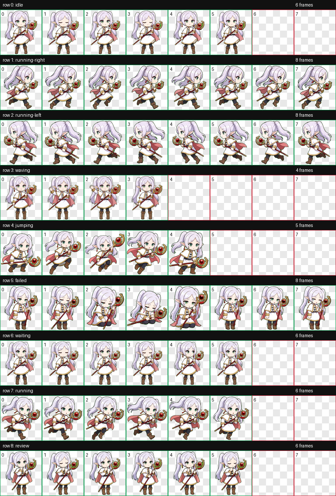
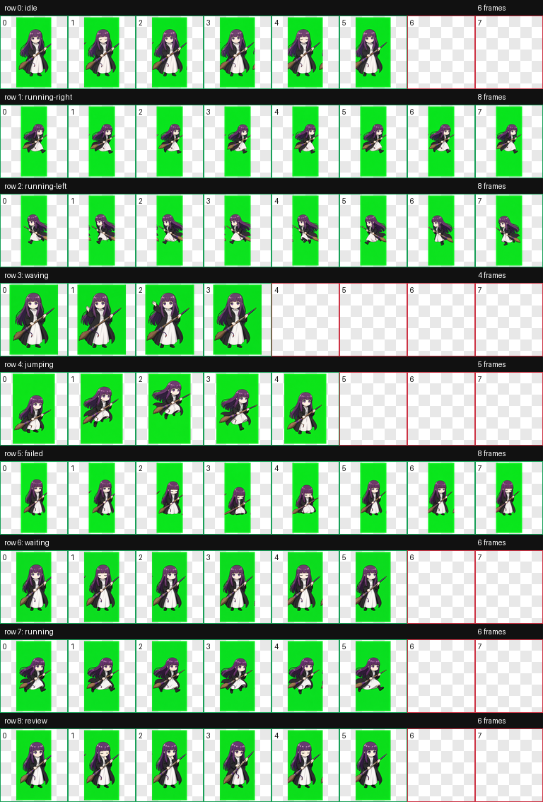

# codex-pet

[English README](./README.md)

把一张角色参考图自动转换成可用的 Codex 自定义 pet，并直接安装到 `~/.codex/pets/<pet-id>/`。

这个仓库提供了一套可复用的 Codex Skill，用来把角色图片转换成经过校验、可部署的 Codex pet 图集。

## 效果图

### 芙莉莲风格示例



### 费伦风格示例



## 仓库包含什么

- `codex-pet-from-image/`
  一个可复用的图片生成 pet Skill
- `codex-pet-from-image/scripts/`
  用于准备运行目录、处理抠图、清理中间结果、记录生成结果和安装 pet 的辅助脚本
- `codex-pet-from-image/references/`
  项目经验摘要和一份完整示例流程

## 这个 Skill 会做什么

`codex-pet-from-image` 会自动完成：

- 使用用户提供的一张图片作为角色主参考
- 以相同风格重建干净的基础角色图
- 去掉背景并收紧透明边界
- 放大准备后的参考角色，避免最终 pet 人物太小
- 创建标准 `hatch-pet` 运行目录
- 用 `imagegen` 生成 9 组必须的动作行
- 在最终打包前清理 decoded 行图中的绿幕背景
- 校验 atlas 并打包为 Codex pet
- 将成品安装到 `~/.codex/pets/<pet-id>/`

## 为什么要做这个仓库

Codex 内置的 pet 流程本身很强，但“从一张图直接做成 pet”这条路径通常还需要几处经验性修正：

- 参考人物默认容易偏小
- 绿幕背景可能残留到中间动作行
- 有些高质量结果更适合用 slot extraction，而不是只依赖 component extraction

这个仓库就是把这些经验整理成一套可重复执行的工作流。

## 安装方式

把 Skill 复制到你的 Codex 技能目录：

```bash
mkdir -p ~/.codex/skills
cp -R codex-pet-from-image ~/.codex/skills/codex-pet-from-image
```

安装后，就可以在任意 Codex 对话里直接调用。

## 快速开始

上传一张参考图后，可以这样说：

```text
Use $codex-pet-from-image to turn this reference image into an installed Codex pet.
```

也可以直接自然语言描述：

```text
Make this character image into a Codex pet and deploy it to the pet repository.
```

## 示例流程

完整的逐步示例在这里：

- [Example Workflow](./codex-pet-from-image/references/example-workflow.md)

这份文档说明了：

- 适合使用什么样的参考图
- 基础角色 cutout 是如何准备的
- 9 组动作行分别如何生成
- 最终清理和校验如何执行
- 成品安装目录最终长什么样

## 仓库结构

```text
codex-pet-from-image/
  SKILL.md
  agents/openai.yaml
  references/
  scripts/
docs/
  assets/
```

## 关键默认参数

- 参考 cutout 默认放大到约 `1.25x`
- 角色在单格里的目标高度大约是 `72%–84%`
- atlas 提取前会先清理 decoded 行图中的绿幕
- finalize 默认使用 `--allow-slot-extraction`

## 输出结果

生成成功后，最终安装目录如下：

```text
~/.codex/pets/<pet-id>/
  pet.json
  spritesheet.webp
```

## 版权与分发说明

这个仓库默认发布的是工作流、说明文档和辅助脚本。

默认不会附带第三方角色 pet 成品。如果你计划公开发布生成后的 pet 资产，请先确认你拥有对应角色图片或衍生素材的再分发权限。
